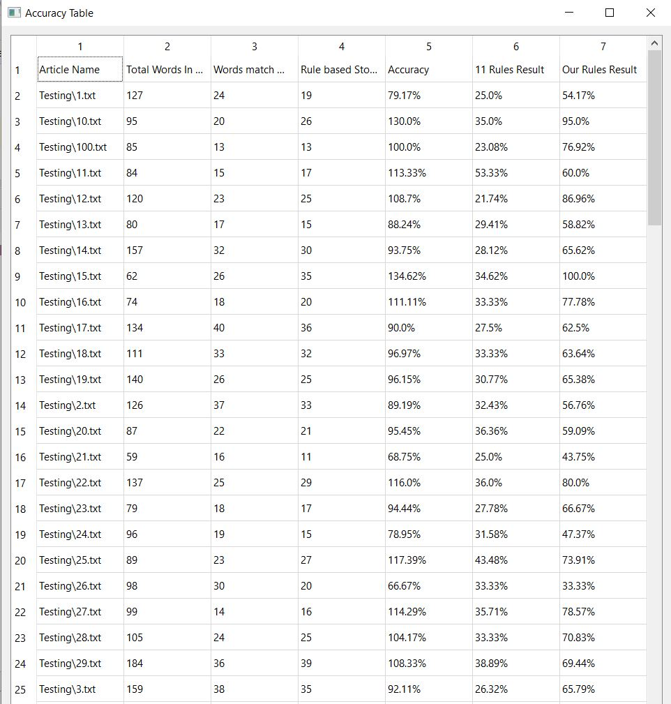

- This project remove stop words from Gujarati articles.
- This project is actually made for Research Paper done by Zalak Jani.
- Till now there is no any particular way to remove stop words from Gujarati articles. In this project i try to remove stop word based on 2, 3, 4 & 5 Letters. I also design some rules for that.
- This project also calculate the accuracy of matchin stop words in articles as well as tell you the size of file after removing stop words.
 
<b>Result of testing on more than 50 articles:</b> 

 
<b>Accuracy table based on rules matched:</b> 

 
<b>Select your own article for testing:</b> 

 
<b>Article before stop words removed:</b> 

 
<b>Article after stop words removed:</b> 

 
